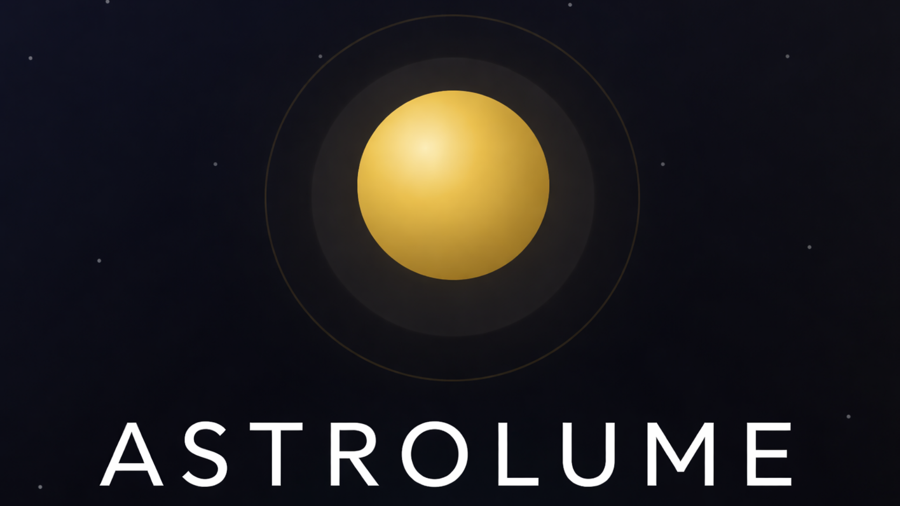

<p align="center">
  
</p>

<p align="center"><strong>By Biowess</strong></p>
<p align="center">A cinematic solar-system explorer built with React, TypeScript, Vite, Tailwind CSS, and React Three Fiber.</p>

## Detailed Stack

<p align="center">
  
  
  
  
  
  
  
  
  
  
</p>

| Layer | Stack | Role in Astrolume |
|---|---|---|
| Runtime | React 19 + TypeScript | Component-driven UI, typed data flow, and page orchestration |
| Build | Vite | Fast dev server, production bundling, static asset handling |
| Styling | Tailwind CSS 4 + custom CSS variables | Glassmorphism panels, typography, responsive layout system |
| Motion | Framer Motion | Route transitions, splash animation, modal transitions |
| 3D | Three.js + React Three Fiber + Drei | Planet rendering, camera framing, environment lighting |
| State | Zustand + persist middleware | Bookmarks, active selection, and user preferences |
| Icons | Lucide React | Navigation, actions, and telemetry UI symbols |
| Routing | React Router | Explorer, detail, bookmarks, docs, about, and settings pages |

## Executive Summary

Astrolume is a premium solar-system explorer that presents the planets as a data-rich, cinematic experience rather than a static reference app. The application combines a 3D orbital carousel, detailed planetary dossiers, image archives, bookmarks, and interface preferences into a single coherent observatory-style interface.

The app solves two common problems in educational space interfaces: first, it makes planetary data visually memorable through interactive 3D presentation; second, it keeps the experience usable and resilient by pairing live planetary telemetry with local fallback data and cached assets. The result is a polished SPA that still works when remote data is incomplete or unavailable.

## Feature Map

| Route | Purpose |
|---|---|
| `/` | Main 3D planetary carousel and launch point |
| `/planet/:id` | Full planetary dossier with telemetry, comparisons, and image archive |
| `/bookmarks` | Saved planetary targets |
| `/documentation` | In-app usage notes |
| `/about` | Project overview and technology summary |
| `/settings` | Display and telemetry preferences |

## Architecture & Build Process

Astrolume is structured as a single-page application with a clean separation between rendering, state, and content data.

### Runtime flow

```ts
main.tsx -> App.tsx -> BrowserRouter -> Shell -> routed page
```

1. `src/main.tsx` mounts the React tree and loads `index.css`.
2. `src/App.tsx` performs the boot sequence before exposing the route tree.
3. During boot, the app runs two asynchronous preparation steps in parallel:
   - fetches planetary data
   - preloads 3D textures
4. Once boot completes, the UI enters the shared `Shell` layout.
5. Individual routes render into the main content area with animated transitions.

### Build pipeline

| Step | File / Tool | What happens |
|---|---|---|
| Dev server | `npm run dev` / Vite | Runs the app on port 3000 with host binding enabled |
| Type check | `npm run lint` / `tsc --noEmit` | Validates TypeScript without emitting output |
| Production build | `npm run build` / Vite | Bundles the SPA into `dist/` |
| Preview | `npm run preview` | Serves the production bundle locally |

### State and data flow

Astrolume uses a single Zustand store (`src/store/useStore.ts`) as the application control plane.

- `planets` holds the active planetary dataset.
- `activePlanetId` synchronizes the selected planet across routes.
- `bookmarks` persists saved targets.
- `settings` stores UI preferences such as starfield visibility, reduced motion, and unit system.
- `persist` keeps bookmarks and settings in local storage so the interface restores state between sessions.

### Component relationships

```text
App
├─ SplashScreen (boot state)
├─ Shell
│  ├─ Background
│  ├─ NavLink rail / bottom nav
│  └─ routed page content
└─ Routes
   ├─ Home
   │  └─ PlanetOrb (3D carousel instances)
   ├─ PlanetDetail
   │  └─ PlanetScene -> PlanetOrb (single framed 3D view)
   ├─ Bookmarks
   ├─ Docs
   ├─ About
   └─ Settings
```

## Under the Hood

### 1) Boot and preload orchestration

The application does not render its main routes until both data and textures are ready.

```ts
await Promise.allSettled([
  fetchPlanets(),
  preloadPlanetTextures(),
]);
setBootReady(true);
```

- This avoids a half-loaded experience where the route tree appears before the 3D assets are available.
- `Promise.allSettled` is intentional: the UI can still continue even if one preparation task fails.
- The splash screen acts as a visual gate while the observatory is warming up.

### 2) Persistent store and user preference model

`useStore.ts` centralizes the application state in a compact but expressive shape.

- `fetchPlanets()` loads enhanced planet telemetry and falls back to bundled data if the remote API is unavailable.
- `toggleBookmark()` adds or removes a planet id from the saved list.
- `updateSettings()` merges partial preference updates without overwriting unrelated options.
- `persist` serializes only bookmarks and settings, keeping transient runtime values out of storage.

```ts
settings: {
  showStars: true,
  reducedMotion: false,
  units: 'metric',
}
```

### 3) Carousel motion model in `Home.tsx`

The home screen is not a static row of objects; it is a circular focus carousel driven by continuous animation.

- Each planet computes its offset relative to the active index.
- Offsets are wrapped so the carousel can loop cleanly.
- Focus state shifts the current planet forward in Z-space while neighboring planets recede.
- The motion uses exponential approach functions to feel heavy, physical, and deliberate.

```ts
offset = planetIndex - currentIndex
if (offset > total / 2) offset -= total
if (offset < -total / 2) offset += total
```

Key behaviors:

- Left and right buttons cycle through planets.
- Keyboard arrows mirror the navigation controls.
- Pointer hover changes cursor affordance.
- Reduced motion settings suppress the most visible transitions.

### 4) `PlanetOrb.tsx` rendering engine

This is the most technically dense module in the project.

- Textures are loaded through a module-level cache to survive React StrictMode double-mounts.
- Every planet uses a scaling multiplier so the carousel remains readable without losing comparative identity.
- Earth includes a separate cloud sphere, rotated independently from the main planet body.
- Saturn uses a custom ring shader and polygon offset to avoid z-fighting.
- Atmosphere shells use a Fresnel-style shader so the glow intensifies toward the limb.

Pseudo-flow:

```text
load texture -> cache texture -> build material -> render sphere -> animate rotation
```

Important implementation patterns:

- **Texture cache**: prevents repeated fetches and improves boot time.
- **Tilt isolation**: the tilt group is separated from the rotation group to avoid pole artifacts.
- **Material specialization**: planets use tuned roughness and environmental intensity values.
- **Focused lighting**: a point light only blooms on the active planet to reinforce selection.

### 5) Detail view framing in `PlanetScene.tsx` and `fitCameraToObject.ts`

The detail page renders a single planet with automatic camera fitting.

- The object’s world matrix is updated before bounding-box computation.
- The camera distance is derived from the larger of the horizontal or vertical frustum constraints.
- Padding is applied to keep the model comfortably framed.
- Near and far planes are recalculated to keep depth precision stable.

```ts
const distance = Math.max(distV, distH) * (1 + padding);
camera.position.set(center.x, center.y, center.z + distance);
camera.lookAt(center);
```

This keeps the detail page robust across different viewport sizes and planet scales.

### 6) Data enrichment and fallback strategy

`src/data/planets.ts` uses a hybrid model.

- A curated fallback dataset provides stable descriptions, colors, and reference values.
- A remote API enriches the numeric telemetry when available.
- If the network request fails, the fallback dataset remains fully usable.

This is the right tradeoff for an educational explorer: the interface stays reliable, while the data layer improves itself opportunistically.

## Installation & Usage

```bash
git clone <your-repo-url>
cd <repo-folder>
npm install
npm run dev
```

Open the local dev server at `http://localhost:3000` after the install completes.

### Production build

```bash
npm run build
npm run preview
```

### Optional checks

```bash
npm run lint
npm run clean
```

## Local Assets

Astrolume expects its imagery to be present in the repository at build and runtime.

- 3D planet textures live under `public/textures/planets/`
- gallery imagery lives under `public/assets/planets/`

If those assets are missing, the app will still boot, but the visual fidelity and gallery experience will be reduced.

## Design Notes

| System | Implementation detail |
|---|---|
| Shell layout | Fixed navigation rail on desktop, bottom bar on mobile |
| Background | Subtle spotlight plus optional starfield layer |
| Typography | Outfit, JetBrains Mono, and Playfair Display |
| Visual style | Dark glassmorphism with gold accent system |
| Motion | Route fades, modal scaling, splash animation, and carousel easing |

## License

**Suggested license: GNU General Public License v3.0 (GPLv3).**

This project is intended to remain strongly copyleft: any redistributed or modified version should preserve the same freedoms under GPLv3 terms.

---

**Creator:** Biowess  
**Project:** Astrolume
